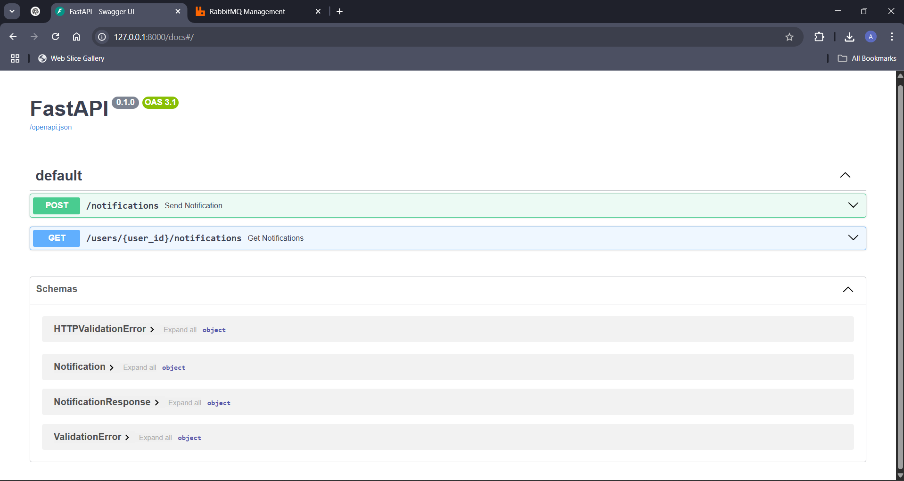
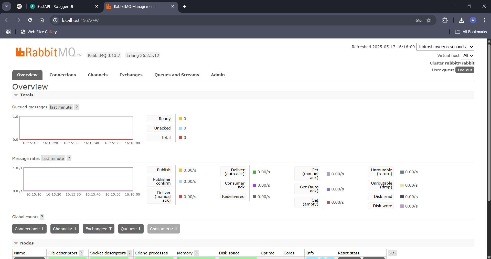

# 📢 Notification Service

A microservice to send notifications to users via **Email**, **SMS**, and **In-App**, using **FastAPI**, **RabbitMQ**, and a simple background worker.


---

## ✨ Features

- 📬 **Send Notification** API (`POST /notifications`)
- 📥 **Get User Notifications** API (`GET /users/{id}/notifications`)
- 🐰 **RabbitMQ Queue** for background processing
- 🔔 **Supports Multiple Notification Types**: Email, SMS, In-App
- ♻️ Easy to extend with retry or persistence logic

---

## 🖥️ Screenshots

| Swagger UI | RabbitMQ Dashboard |
|------------|--------------------|
|  |  |

---

## 🚀 Quick Start

### 🧾 Prerequisites

- [Python 3.10+](https://www.python.org/downloads/)
- [Docker](https://www.docker.com/)
- [RabbitMQ](https://hub.docker.com/_/rabbitmq) (via Docker)

---

### 📝 **Assumptions**

- Notifications are simulated via `print()` statements.
- No persistent database is used; an in-memory Python `dict` is utilized.
- Retry and failure handling is **not yet implemented** (can be added later).

---

### 📦 Setup

1. **Clone the Repository**

```bash
git clone https://github.com/adarshabhishek/notification_service.git
cd notification_service


2. **Create and Activate Virtual Environment**

```bash
python -m venv venv
.\venv\Scripts\activate  # Windows
```

3. **Install Dependencies**

```bash
pip install -r requirements.txt
```

4. **Start RabbitMQ in Docker**

```bash
docker run -d --hostname my-rabbit --name rabbitmq -p 5672:5672 -p 15672:15672 rabbitmq:3-management
```

Access management dashboard at: [http://localhost:15672](http://localhost:15672)  
Default login: `guest` / `guest`

---

## ⚙️ Running the Project

### Start the FastAPI App

```bash
uvicorn app.main:app --reload
```

Swagger UI: [http://127.0.0.1:8000/docs](http://127.0.0.1:8000/docs)

### Start the Worker (In a New Terminal)

```bash
# PowerShell:
$env:PYTHONPATH = "."; python app/worker.py

# OR Command Prompt:
set PYTHONPATH=. && python app/worker.py
```

---

## 🧪 How to Use

### 🔹 1. Send a Notification

**POST /notifications**

```http
POST /notifications
Content-Type: application/json

{
  "user_id": 1,
  "type": "email",
  "message": "Welcome to Notification Service!"
}
```

📌 `type` can be: `email`, `sms`, or `inapp`

### 🔹 2. View Notifications by User

**GET /users/1/notifications**

```http
GET /users/1/notifications
```

---

